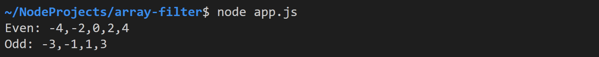

# My Array Filter

Erstellen Sie die Datei `app.ts` und entwickeln Sie darin folgende Applikation.

## Task 1: Function `isEven()`

Implementieren Sie die Funktion `isEven(num)`. Diese soll genau dann `true` zurückgeben, wenn die übergebene Zahl `num` gerade ist.

Vergessen Sie nicht die Datentypen des Parameters und des Rückgabewerts zu deklarieren. Testen Sie die Funktion!

## Task 2: Function `filter()`

Implementieren Sie die Funktion `filter(nums: number[], test: (num: number) => boolean)`, die eine neues Array zurückgibt. In diesem sollen alle Zahlen aus `nums`enthalten sein, bei denen die übergebene `test`-Funktion den Wert `true` zurückgibt.

Fügen Sie am Programmende folgenden Testfall hinzu.

```javascript
let bigNums = filter([10, 5000, 300, 2000], function (num) {
    return num > 1000;
});
console.log(bigNums);
```

Überprüfen Sie ob die Applikation die Zahlen `5000` und `2000` ausgibt.


## Task 3: Even numbers

Entfernen Sie die Testausgabe aus der vorherigen Aufgabe. Legen Sie anschließend am Programmende folgendes Array an:

```javascript
const numbers = [-4, -3, -2, -1, 0, 1, 2, 3, 4];
```

Rufen Sie `filter()` mit `isEven` als `test`-Funktion auf, um aus `numbers` die geraden Zahlen herauszufiltern. Geben Sie das Ergebnis aus.


## Task 4: Odd numbers

Als Nächstes sollen die ungeraden Zahlen ausgegeben werden. Rufen Sie hierfür `filter()` erneut auf und übergeben Sie eine anonyme Testfunktion.

**Tipp:** Die Testfunktion kann sehr kompakt implementiert werden, wenn sie darin `isEven()` aufrufen.



## Task 5: Negative numbers

Abschließend sollen auch die negativen Zahlen ausgegeben werden. Rufen Sie hierfür `filter()` erneut auf und übergeben Sie wieder eine anonyme Testfunktion.


